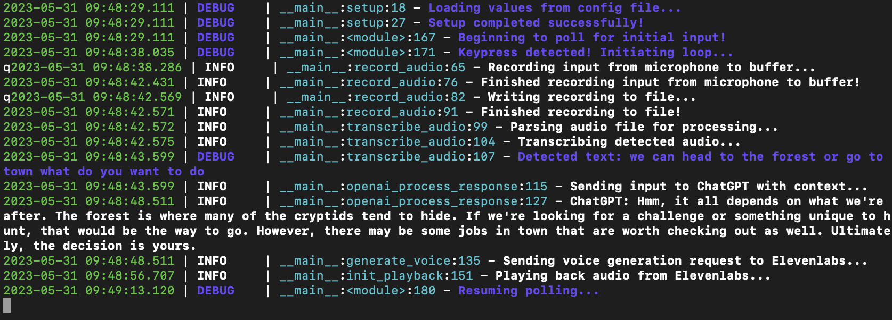

# verbiage-gpt

**verbiage-gpt** is a quick script to enable a console-style interface for relaying the following flow:

1. Speak some surrounding flavor into your configured microphone for the script to process.
2. Script extracts text from your speech and passes that to ChatGPT.
3. [ChatGPT](https://openai.com/) generates a response from your flavor plus added character-specific context [configured beforehand.]
4. The ChatGPT response is sent to [Elevenlabs](https://elevenlabs.io/) for audio processing using an AI voice.
5. The vocalized response from Elevenlabs is relayed back & played locally.

## Sample Use Case

This is something that can be used to toy around with personally or even use in a wider setting, such as with friends or streaming via Twitch/YouTube.

(This utility essentially [mimics DougDoug's setup for doing the same thing](https://www.youtube.com/watch?v=2C-4Inr20sw) on some of his livestreams during gameplay.)

For example:
- You've decided to [play Skyrim with a modded Geralt follower](https://www.nexusmods.com/skyrimspecialedition/mods/14127).
- You can configure a mock-Geralt voice in Elevenlabs by using personal-use copycat samples.
- You provide the necessary keys & setup values in your own `config.json` spun out from the `config_template.json` reference in the repo.
- You run the script and are then able to ask "Geralt" questions via voice, such as where he'd like to go next.
- The mock voice speaking ChatGPT's response is relayed back, allowing Geralt to respond back to you with where he'd like to head to next in Skyrim.


## Installation

Just clone the project here locally & install the required libraries using `pip install -r requirements.txt`. Then, configure a `config.json` file filled out with:
- A working Open AI API key.
- A working Elevenlabs API key.
- Add the name of the voice configured in Elevenlabs.
- Add context info for the character you're interacting with.

## Usage

```python
python main.py -f config.json
```

**Note**: `keyboard` for using a key to trigger the microphone recording & cut-off seems to need admin access, so running as admin / via `sudo` is necessary.

## The Laundry List
- Store some added context locally or via [Pinecone](https://www.pinecone.io/) so that a proper memory with the GPT agent is established.
- More to come...
